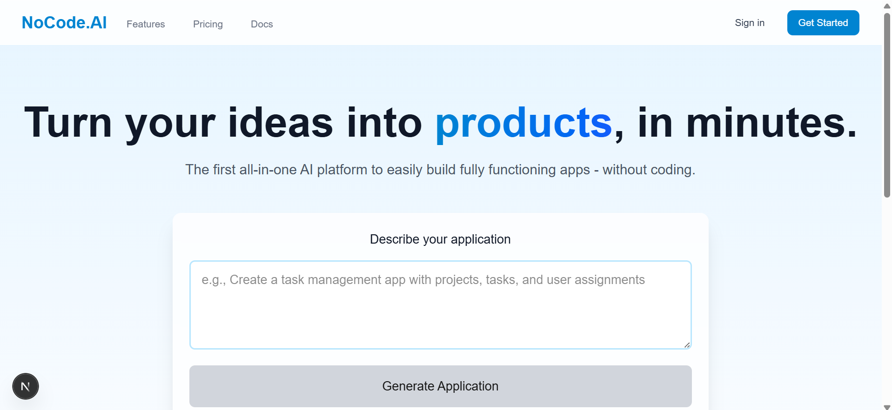

# AI-Powered No-Code Platform MVP

A cutting-edge no-code platform that transforms natural language into fully functional applications. Built with Next.js 14, TypeScript, and OpenAI.




## 🌟 Key Features

### 1. Natural Language to UI Generation
- Transform text descriptions into fully functional UI components
- Support for various component types (Forms, Tables, Lists, Cards)
- Real-time preview of generated components
- Responsive and modern design out of the box

### 2. Intelligent Schema Generation
- Automatic database schema generation from natural language
- Visual schema representation
- Relationship mapping between entities
- Prisma schema generation for immediate use

### 3. Code Generation
- Production-ready React components
- Type-safe database schemas
- Clean and maintainable code output
- Modern best practices implementation

### 4. Instant Preview & Sharing
- Real-time preview of generated components
- Shareable preview links for team collaboration
- Interactive component testing
- Visual database schema explorer

### 5. Modern UI/UX
- Clean and intuitive interface
- Responsive design for all devices
- Smooth animations and transitions
- Glassmorphism design elements

## 🚀 Technical Stack

- **Frontend**: Next.js 14, React, TypeScript
- **Styling**: TailwindCSS, HeadlessUI
- **Form Handling**: React Hook Form, Zod
- **AI Integration**: OpenAI GPT-4
- **Database**: Prisma ORM
- **Type Safety**: TypeScript, tRPC
- **State Management**: Zustand

## 🎯 MVP Scope

### Implemented Features
1. ✅ Natural Language Processing
   - AI-powered interface generation
   - Schema generation from text descriptions
   - Intelligent component mapping

2. ✅ Component Generation
   - Form components with validation
   - Data tables
   - List views
   - Card layouts

3. ✅ Database Schema
   - Visual schema representation
   - Relationship mapping
   - Auto-generated Prisma schema
   - Type-safe database models

4. ✅ Modern UI/UX
   - Clean, intuitive interface
   - Responsive design
   - Real-time previews
   - Shareable results

### Next Phase Features
1. 🔄 Authentication & Authorization
   - User management
   - Role-based access control
   - Secure authentication flow

2. 🔄 API Generation
   - RESTful endpoints
   - tRPC integration
   - API documentation
   - Swagger/OpenAPI specs

3. 🔄 Deployment
   - One-click deployment
   - Vercel/Railway integration
   - Environment setup
   - CI/CD pipeline

4. 🔄 Email Integration
   - SMTP setup
   - Email templates
   - Notification system

## 🚀 Getting Started

1. Clone the repository
   ```bash
   git clone https://github.com/yourusername/nocode-ai-platform.git
   ```

2. Install dependencies
   ```bash
   npm install
   ```

3. Set up environment variables
   ```bash
   cp .env.example .env
   ```

4. Add your OpenAI API key to `.env`
   ```
   NEXT_PUBLIC_OPENAI_API_KEY=your_api_key_here
   ```

5. Run the development server
   ```bash
   npm run dev
   ```

## 🎯 Use Cases

1. **Rapid Prototyping**
   - Quick MVP generation
   - Idea validation
   - Client presentations

2. **Internal Tools**
   - Admin dashboards
   - CRUD applications
   - Data management systems

3. **Custom Solutions**
   - Client portals
   - Booking systems
   - Content management systems

## 🔒 Security & Best Practices

- Secure API key handling
- Type-safe throughout
- Modern React patterns
- Responsive design principles
- Clean code architecture
- Performance optimized

## 🎯 Next Steps

1. **Authentication System**
   - User management
   - Role-based access
   - Secure authentication flow

2. **API Generation**
   - RESTful endpoints
   - API documentation
   - Testing interface

3. **Deployment Pipeline**
   - One-click deploy
   - CI/CD setup
   - Environment management

4. **Email Integration**
   - SMTP setup
   - Template management
   - Notification system

## 📝 License

MIT License - see the [LICENSE.md](LICENSE.md) file for details

## 🤝 Contributing

Contributions, issues, and feature requests are welcome! See [CONTRIBUTING.md](CONTRIBUTING.md) for ways to get started.

## 📬 Contact

Panji Depasha - [@satpamblockchain](https://twitter.com/satpamblockchain) - satpamblockchain@gmail.com

Project Link: [https://github.com/laflamics/MVP-Platform.git](https://github.com/laflamics/MVP-Platform.git)
